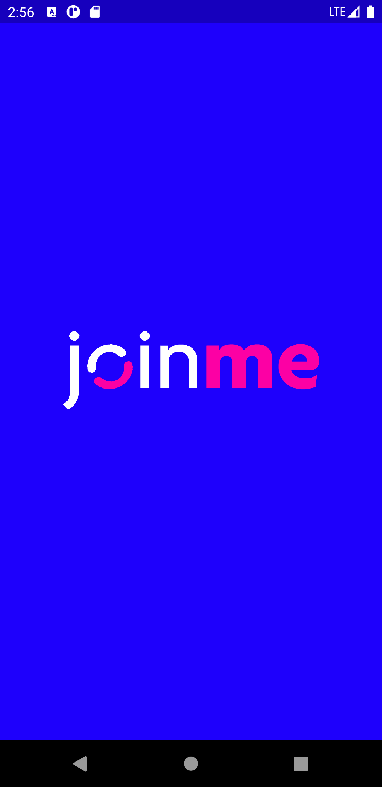
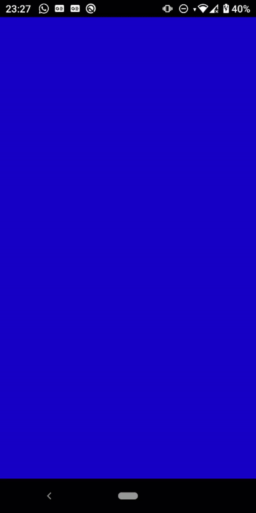

1. Modularização
2. Clean Dart
3. Injeção de dependência
4. Local Storage

## Principais Packages
Gerenciamento de estado - Triple Builder

Modularização e Injeção de dependências - Modular

Client - Dio

Local - Flutter Secure Storage

Dartz - 
Utilizado para o tratamento de exceções com o Either do Dartz retornamos dois tipos de objetos uma falha e um objeto de sucesso que pode ser uma lista por exemplo.

Ao utilizar um usecase utilizamos o fold para obter os retornos (Falha e Sucesso):

```dart
final response = fetchAllEventsUsecase();
   response.fold((failure){
   //TODO: FALHA 
   }, (result) {
   //TODO: SUCESSO
  });

```


             
